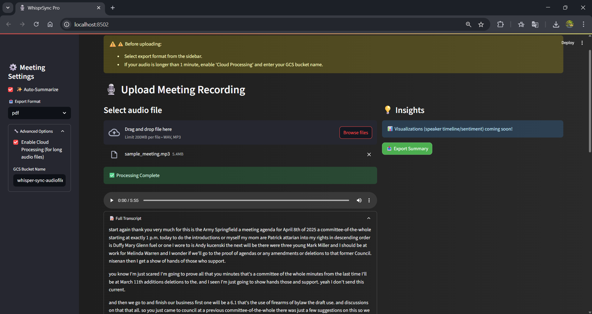

# 🎙️ WhisprSync Pro

**AI-Powered Meeting Transcription, Summarization & Export Suite**

---

## 🚀 Overview

WhisprSync Pro is a next-generation tool that transforms your meeting recordings into actionable insights. Leveraging advanced speech-to-text, NLP, and cloud technologies, it delivers clean transcripts, smart summaries, and exportable reports in multiple formats—all with a beautiful, modern UI.

- **Transcribe** audio meetings with high accuracy (Google Cloud Speech-to-Text)
- **Summarize** with AI: extract key points and action items
- **Export** as PDF, HTML, or TXT
- **Chunk** transcripts by natural pauses for easy review
- **Cloud processing** for long audio files (Google Cloud Storage)
- **Streamlit UI** for seamless, interactive experience

---

## 🧩 Features

- **🎤 Audio In, Insights Out:** Upload WAV/MP3 files and get instant, structured meeting notes.
- **✨ AI Summarization:** Extracts key points and action items using NLP and keyword extraction.
- **📄 Multi-format Export:** Download summaries as PDF, HTML, or TXT.
- **☁️ Cloud-Ready:** Handles long meetings via Google Cloud Storage and async recognition.
- **🧠 Smart Chunking:** Splits transcripts at natural pauses for clarity.
- **🖥️ Modern UI:** Streamlit-powered, dark-themed, and user-friendly.
- **🔒 Privacy-First:** Local processing by default; cloud only if you opt in.

---

## 🖼️ UI Preview

 

---

## 🛠️ Quickstart

### 1. **Install Dependencies**

```bash
pip install -r requirements.txt
```

### 2. **Google Cloud Setup**

- Place your `google-key.json` in the project root.
- Set the environment variable:
  ```bash
  $env: GOOGLE_APPLICATION_CREDENTIALS="google-key.json"
  ```

### 3. **Run the App**

```bash
streamlit run app/main_ui.py
```

### 4. **Command-Line Usage**

```bash
python main.py --input path/to/audio.wav --output txt --summarize --format pdf
```

#### **Options:**
- `--input`: Path to audio file (wav/mp3)
- `--output`: Output transcript format (`txt`/`json`)
- `--summarize`: Enable AI summary
- `--format`: Export format (`pdf`/`html`/`txt`)
- `--long`: Use cloud processing for long files
- `--gcs_bucket`: GCS bucket name (required for long files)

---

## 🧬 How It Works

1. **Audio Preprocessing:** Converts audio to 16kHz mono WAV for optimal recognition.
2. **Transcription:** Uses Google Cloud Speech-to-Text (sync or async for long files).
3. **Cleaning:** Removes filler words and stutters for clarity.
4. **Chunking:** Splits transcript at natural pauses.
5. **Summarization:** Extracts key points and action items using NLP (RAKE, NLTK).
6. **Export:** Generates PDF, HTML, or TXT summaries.
7. **UI:** Streamlit app for upload, review, and download.

---

## 🌐 Cloud & Privacy

- **Local by default:** All processing is local unless you enable cloud mode for long files.
- **Cloud mode:** Audio is uploaded to your GCS bucket for processing, then deleted.

---

## 🧠 Innovation Highlights

- **Timing aware** and pause-based chunking for human-like transcripts.
- **Action item mining** using trigger phrase detection and NLP.
- **One-click export** to professional PDF/HTML for sharing.
- **Dark-themed, modern UI** with real-time feedback and future-ready for analytics.

---

## 🙏 Acknowledgements

- [Google Cloud Speech-to-Text](https://cloud.google.com/speech-to-text)
- [Streamlit](https://streamlit.io/)
- [NLTK](https://www.nltk.org/)
- [RAKE-NLTK](https://github.com/csurfer/rake-nltk)
- [FPDF](https://pyfpdf.github.io/)

---

**WhisprSync Pro — Let your meetings speak for themselves.**
